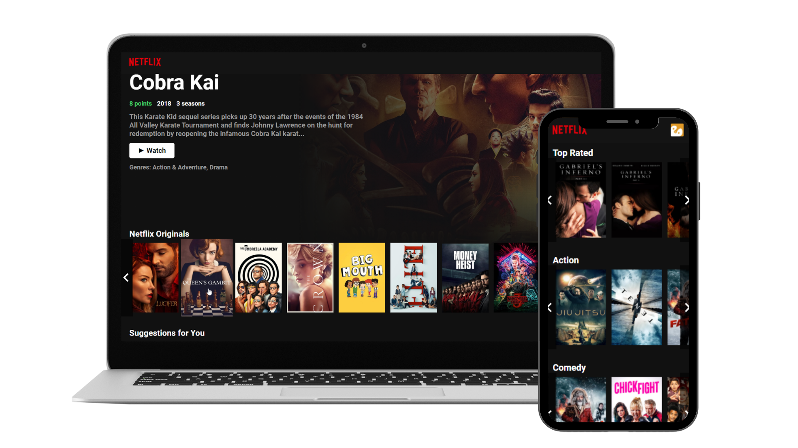

<div align="center">

<p align="center">
  
<p>

<p align="center">	
  
  
</p>

**Netflix UI Clone** is a mini project that brings information about series from TMDB API using the same main categories from Netflix. 


The idea of this project is just to boost my abilities with React.js, HTML, and CSS3.

<p align="center">
  
<p>

</div>

## Live Demo

Access:

[Netflix - UI Clone](https://netflix-uiclone.vercel.app/)


## Summary

- [Technology](#rocket-technology)
  - [Web](#computer-web)
- [How to run](#boom-how-to-run)
  - [Web](#computer-web-1)


## :rocket: Technology

<div align="center">


</div>


## :computer: Web

The _web_ version of the application was developed with [Javascript](https://developer.mozilla.org/en-US/docs/Web/JavaScript/) using the framework [ReactJS](https://reactjs.org/). The images and the description was made using [Tmdb](https://www.themoviedb.org/) API. Also, the application is fully responsive following the CSS structure.

---

# :boom: How to run

- ### **Prerequisites**

  - It's **necessary** to have **[Node.js](https://nodejs.org/en/)** installed on the computer
  - It's **necessary** to have **[Git](https://git-scm.com/)** installed and configured on the computer
  - Also, it's **necessary** to have a package manager either **[NPM](https://www.npmjs.com/)** or **[Yarn](https://yarnpkg.com/)**.
  
Clone the repository:

```sh
  $ git clone https://github.com/paulo-carvalho93/netflix-uiclone.git
```

## TMDB API KEY

You need a TMDB API KEY to be able to render all images and descriptions.
Go to https://www.themoviedb.org and create your account.

After creating your KEY, follow the instructions:
```
# Create a new file at project root with the name: 
$ .env
# Then, just fill the file with following content:
$ REACT_APP_TMDB_KEY=YOUR_KEY_HERE

```

## :computer: Web

```sh
  # API
  $ cd netflix-uiclone
  # Installing project dependencies.
  $ yarn # or npm install
  
  # Start Web Project
  $ yarn start # or npm start
  
  # Do you want to publish ?
  $ yarn build # or npm build
  # Static files for web will be saved in the `public` folder
  
```

## :memo: Attention

All image rights reserved for Netflix. 

This is just a project for study purposes.

---
